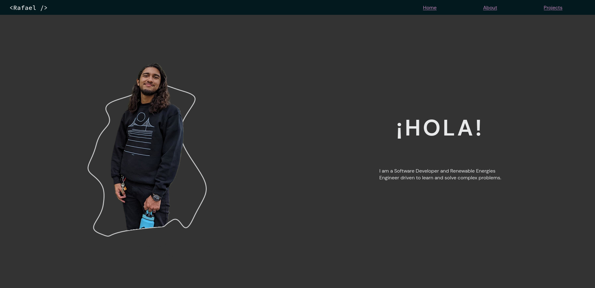

# Rafael Avilés | Software Developer Portfolio💻

This is a portfolio website made using HTML, CSS, TypeScript and Vitejs. It is the second 
iteration of my personal website, and I wanted to go for simplicity and minimalism, both 
in the technologies I used and the overall website design.

## Features
- A landing page, about me, my skills, and portfolio.
- Links to all the places where you can find me on the internet, including my blog posts.

## Screenshots

## Tech Stack
- HTML5
- CSS3
- Vitejs
- Typescript

Icons from Material Design Icons on iconify.design
